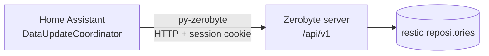

# Zerobyte Home Assistant Integration

[](https://hacs.xyz)
[](https://github.com/t0mer/zerobyte-custom-component/blob/main/LICENSE)

A [Home Assistant](https://www.home-assistant.io/) custom integration for [Zerobyte](https://github.com/nicotsx/zerobyte), the self-hosted backup automation tool built on [restic](https://restic.net/). It brings your Zerobyte volumes, repositories and backup schedules into Home Assistant as devices and entities. You can watch storage and backup status on your dashboards, get alerted when a backup fails, and start, stop or schedule backup operations from automations.

The integration talks to the Zerobyte REST API through the [`py-zerobyte`](https://github.com/t0mer/py-zerobyte) Python library.

> This is an unofficial, community-built integration. It is not affiliated with, endorsed by, or supported by the Zerobyte project, the restic project, or Home Assistant.


*The card in this screenshot is a separate Lovelace card, not part of this integration. This integration provides devices and entities only.*

<!-- TODO: verify — the screenshot shows an empty Zerobyte server (0 jobs, 0 volumes, 0 repos). Consider replacing it with a screenshot of this integration's devices and entities. -->

---

## Table of contents

- [Features](#features)
- [Requirements](#requirements)
- [Installation](#installation)
- [Configuration](#configuration)
- [Devices and entities](#devices-and-entities)
- [Example automations and cards](#example-automations-and-cards)
- [How it works](#how-it-works)
- [Troubleshooting](#troubleshooting)
- [Security notes](#security-notes)
- [Development](#development)
- [Contributing](#contributing)
- [Credits](#credits)
- [License](#license)

---

## Features

- **UI setup**: add the integration from **Settings → Devices & services**. No YAML is needed.
- **Volume monitoring**: total, used and free space (GiB) for each Zerobyte volume, and whether it is mounted.
- **Repository monitoring**: repository status, time of the last health check, snapshot count, and time of the newest snapshot.
- **Backup schedule monitoring**: last backup result and time, and the next scheduled run.
- **Schedule control**: a switch per schedule to enable or disable it.
- **Action buttons**: run a backup now, stop a running backup (see [Known issues](#known-issues)), apply the retention policy (restic `forget`), and mount or unmount a volume.
- **Adjustable polling**: poll every 1 to 1440 minutes (default 5), changeable at any time from the integration options.
- **Devices**: one device per Zerobyte server, and one device per volume, repository and backup schedule, linked to the server device.

The integration does not register any Home Assistant services (actions) of its own. Use the standard `button.press`, `switch.turn_on` and `switch.turn_off` actions on its entities.

---

## Requirements

| Requirement | Details |
|---|---|
| Home Assistant | `hacs.json` declares **2024.1.0**. However, the config flow imports `ConfigFlowResult` (added in Home Assistant 2024.4), and the options flow relies on the framework-provided `config_entry` (Home Assistant 2024.11 or newer), so use a recent release. <!-- TODO: verify the real minimum Home Assistant version --> |
| Zerobyte | A running [Zerobyte](https://github.com/nicotsx/zerobyte) server that Home Assistant can reach over HTTP(S). Zerobyte listens on port `4096` by default. The integration uses the `/api/v1` REST API and identifies volumes and repositories by their `shortId`. <!-- TODO: verify the minimum supported Zerobyte version --> |
| Zerobyte account | A username and password for a Zerobyte user. |
| Python library | [`py-zerobyte`](https://pypi.org/project/py-zerobyte/) `>=1.3.0`. Home Assistant installs it automatically from `manifest.json`. |
| HACS | Optional. Needed only for the HACS installation method. |

---

## Installation

### Option 1: HACS (custom repository)

This integration is not in the HACS default store, so add it as a **custom repository** first.

> [!WARNING]
> HACS installation is most likely broken right now. `hacs.json` sets `"content_in_root": true`, which tells HACS that the integration files are in the repository root, but the root only holds a copy of `manifest.json`. The integration code lives in `custom_components/zerobyte/`, which is where the [HACS integration requirements](https://hacs.xyz/docs/publish/integration/) say it must be (`custom_components/<name>/`). A HACS download therefore most likely does not load. Use the [manual installation](#option-2-manual) until `hacs.json` and the root `manifest.json` are fixed.

1. Open **HACS** in Home Assistant.

   

2. Click the **⋮** (three-dot) menu in the top-right corner and choose **Custom repositories**.
3. Enter the repository URL and select **Integration** as the type:

   | Field | Value |
   |---|---|
   | Repository | `https://github.com/t0mer/zerobyte-custom-component` |
   | Type | Integration |

4. Click **Add**.
5. Search for **Zerobyte** in HACS:

   

6. Open the **Zerobyte** entry, click **Download**, and confirm.
7. Restart Home Assistant (**Settings → System → Restart**).

### Option 2: Manual

1. Download or clone this repository.
2. Copy the `custom_components/zerobyte` folder into the `custom_components` folder of your Home Assistant configuration directory, so that you end up with `<config>/custom_components/zerobyte/manifest.json`.
3. Restart Home Assistant.

---

## Configuration

### Step 1: Add the integration

Go to **Settings → Devices & services** and click **+ Add integration**.


Search for **Zerobyte** and select it.

### Step 2: Connect to your Zerobyte server

The **Connect to Zerobyte** form has three required fields:

| Field | Description | Example |
|---|---|---|
| **Server URL** | Base URL of your Zerobyte server, including the scheme and port | `http://192.168.1.10:4096` |
| **Username** | Your Zerobyte account username | `admin` |
| **Password** | Your Zerobyte account password | _(your password)_ |

The hint under the Server URL field shows port `3000` in its example, but Zerobyte listens on port `4096` by default.

When you click **Submit**, the integration logs in to Zerobyte and reads the current session to check the credentials. If this works, it creates a config entry titled `Zerobyte (<Server URL>)`, and adds devices and entities for every volume, repository and backup schedule it finds.

Each Server URL can be added only once. Adding the same URL again stops with *"This Zerobyte server is already configured"*.

There is no option for API keys or for turning off TLS certificate checks. The connection uses the default behavior of the Python `requests` library.

### Step 3: Options (update interval)

Open the Zerobyte integration and click **Configure** to change the update interval:

| Option | Default | Range | Description |
|---|---|---|---|
| **Update interval (minutes)** | `5` | `1`–`1440` | How often Home Assistant polls the Zerobyte server |

When you save a changed interval, the integration reloads and the new interval takes effect right away. Saving without changing the value does not reload it.

To change the Server URL, username or password, delete the integration entry and add it again. There is no reconfigure or re-authentication flow.

---

## Devices and entities

The integration creates these devices:

| Device | Model | Created for | Name |
|---|---|---|---|
| Server | `Backup Server` | Each config entry | `Zerobyte (<Server URL>)` |
| Volume | `Volume` | Each volume that has a `shortId` | Volume name |
| Repository | `Repository` | Each repository that has a `shortId` | Repository name |
| Backup schedule | `Backup Schedule` | Each schedule that has an `id` | Schedule name |

Volume, repository and schedule devices are linked to the server device. All devices use `Zerobyte` as the manufacturer. The server device has no entities of its own.

Entity names are combined with the device name (`has_entity_name`), so entity IDs look like `sensor.<device_name>_last_backup_status`.

### Volume entities

| Entity | Platform | Device class / unit | State | Attributes |
|---|---|---|---|---|
| Mounted | `binary_sensor` | `connectivity` | On when the volume status is `mounted` (shown as *Connected* / *Disconnected* in the UI) | `backend`, `status`, `path`, `last_error`, `last_health_check` |
| Storage Total | `sensor` | `data_size`, GiB, `measurement` | Total capacity | `backend`, `path` |
| Storage Used | `sensor` | `data_size`, GiB, `measurement` | Used space | `backend`, `path` |
| Storage Free | `sensor` | `data_size`, GiB, `measurement` | Free space | `backend`, `path` |
| Mount | `button` | — | Mounts the volume (`POST /api/v1/volumes/{shortId}/mount`), then refreshes the data | — |
| Unmount | `button` | — | Unmounts the volume (`POST /api/v1/volumes/{shortId}/unmount`), then refreshes the data | — |

The storage sensors come from the volume's `statfs` data. Zerobyte v0.43.1 always returns `statfs` and reports `0` when it has no figures, so the sensors can show `0`. They are unavailable only when the per-volume detail request fails. `path`, `last_error` and `last_health_check` appear only when Zerobyte provides them.

### Repository entities

| Entity | Platform | Device class / unit | State | Attributes |
|---|---|---|---|---|
| Status | `sensor` | — | Repository status as reported by Zerobyte | `backend`, `compression_mode`, `created_at`, `last_error`, and one of `path` / `bucket` / `remote` |
| Last Checked | `sensor` | `timestamp` | Time of the last repository check | — |
| Snapshot Count | `sensor` | `snapshots`, `measurement` | Number of snapshots in the repository. Shows `0` if the snapshot request failed | — |
| Latest Snapshot | `sensor` | `timestamp` | Time of the newest snapshot. Does not work on Zerobyte v0.43.1 (see [Known issues](#known-issues)) | `snapshot_id`, `hostname`, `paths`, `tags` |

### Backup schedule entities

| Entity | Platform | Device class / unit | State | Attributes |
|---|---|---|---|---|
| Last Backup Status | `sensor` | — | Result of the last run as reported by Zerobyte, for example `success`, `warning`, `error` or `in_progress` | `cron_expression`, `last_backup_error` |
| Last Backup | `sensor` | `timestamp` | When the last backup ran | — |
| Next Backup | `sensor` | `timestamp` | When the next backup is scheduled | — |
| Enabled | `switch` | — | On when the schedule is enabled. Turning it on or off sends `PATCH /api/v1/backups/{id}` with `enabled`, `repositoryId` and `cronExpression`, then refreshes the data | `cron_expression`, `backup_paths` (read from `backupPaths`; Zerobyte v0.43.1 names this field `includePaths`, so the attribute does not appear), `exclude_patterns`, `retention_policy`, `volume`, `repository` |
| Run Backup | `button` | — | Starts the backup now (`POST /api/v1/backups/{id}/run`) | — |
| Stop Backup | `button` | — | Tries to stop a running backup (`POST /api/v1/backups/{id}/stop`). Fails on Zerobyte v0.43.1 (see [Known issues](#known-issues)) | — |
| Run Retention | `button` | — | Applies the schedule's retention policy now (`POST /api/v1/backups/{id}/forget`) | — |

The Run Backup, Stop Backup and Run Retention buttons do not trigger a refresh. The schedule sensors show the new state after the next poll.

### Known issues

These were checked against Zerobyte v0.43.1 and py-zerobyte 1.3.0:

- **Stop Backup fails.** Zerobyte v0.43.1 has no `POST /api/v1/backups/{id}/stop` route; it cancels running backups through `POST /api/v1/tasks/{taskId}/cancel`. Pressing the button returns HTTP 404 and shows *"Failed to stop backup: …"*.
- **Latest Snapshot shows no time.** Zerobyte v0.43.1 returns the snapshot `time` as a number (milliseconds), but the sensor expects an ISO-8601 string. Parsing it raises an error, so the sensor does not show a time.
- **`backup_paths` attribute missing.** The Enabled switch reads `backupPaths`, which Zerobyte v0.43.1 now calls `includePaths`.

---

## Example automations and cards

Replace the entity IDs with the ones Home Assistant created for your devices.

### Notify when a backup fails

```yaml
automation:
  - alias: "Zerobyte: alert on backup failure"
    triggers:
      - trigger: state
        entity_id: sensor.my_schedule_last_backup_status
        to: "error"
    actions:
      - action: notify.mobile_app_my_phone
        data:
          title: "Backup failed"
          message: >
            {{ state_attr('sensor.my_schedule_last_backup_status', 'last_backup_error') or 'The Zerobyte backup failed.' }}
```

### Run a backup every night

```yaml
automation:
  - alias: "Zerobyte: nightly backup"
    triggers:
      - trigger: time
        at: "03:00:00"
    actions:
      - action: button.press
        target:
          entity_id: button.my_schedule_run_backup
```

### Warn when a volume is low on free space

```yaml
automation:
  - alias: "Zerobyte: volume low on space"
    triggers:
      - trigger: numeric_state
        entity_id: sensor.my_volume_storage_free
        below: 10   # GiB
    actions:
      - action: notify.mobile_app_my_phone
        data:
          message: "Zerobyte volume has less than 10 GiB free."
```

### Pause a schedule while you are away

```yaml
automation:
  - alias: "Zerobyte: pause schedule when away"
    triggers:
      - trigger: state
        entity_id: group.family
        to: "not_home"
    actions:
      - action: switch.turn_off
        target:
          entity_id: switch.my_schedule_enabled
```

The `triggers` / `actions` / `trigger:` / `action:` syntax needs Home Assistant 2024.10 or newer. On older versions, use `trigger` / `action` / `platform:` / `service:`.

### Dashboard card: volume status

```yaml
type: entities
title: Backup volume
entities:
  - entity: binary_sensor.my_volume_mounted
  - entity: sensor.my_volume_storage_total
  - entity: sensor.my_volume_storage_used
  - entity: sensor.my_volume_storage_free
  - entity: button.my_volume_mount
  - entity: button.my_volume_unmount
```

---

## How it works



- **Login**: `py-zerobyte` logs in with the username and password (`POST /api/auth/sign-in/username`) and keeps the session cookie. The config flow checks the login with `GET /api/auth/get-session`.
- **Polling**: one `DataUpdateCoordinator` per config entry polls at the configured interval (default 5 minutes). Each poll makes these calls:
  1. `GET /api/v1/volumes` (volumes).
  2. `GET /api/v1/repositories` (repositories).
  3. `GET /api/v1/backups` (backup schedules).
  4. `GET /api/v1/volumes/{shortId}` for each volume (to get `statfs` and the path).
  5. `GET /api/v1/repositories/{shortId}/snapshots` for each repository.
- **Blocking I/O**: `py-zerobyte` is a synchronous `requests` client, so every API call runs in Home Assistant's executor thread pool.
- **Errors**: if a single volume detail or snapshot request fails, it is logged at debug level and that item is shown without details. A failed snapshot request is stored as an empty list, so Snapshot Count shows `0`. Don't read that `0` as "no snapshots" without checking the debug log. If one of the list calls fails, the whole poll fails and all entities become unavailable until the next successful poll. On an authentication error (HTTP 401), the client is discarded and a new login is made on the next poll.
- **Entity discovery**: entities are created once, when the integration loads. Volumes, repositories or schedules added in Zerobyte later appear after you reload the integration. Items removed in Zerobyte become unavailable; they are not deleted automatically.

---

## Troubleshooting

| Symptom | Cause / fix |
|---|---|
| *"Could not connect to the Zerobyte server"* during setup | Home Assistant could not reach the Server URL, or the server returned an unexpected error. Check the scheme (`http`/`https`), host and port (Zerobyte defaults to `4096`) from the Home Assistant host. |
| *"Invalid username or password"* during setup | Zerobyte returned HTTP 401. Check the credentials by logging in to the Zerobyte web UI. |
| *"Unexpected error — check the HA logs for details"* | An unexpected exception happened during setup. Look for `Unexpected error connecting to Zerobyte` in the Home Assistant logs. |
| *"This Zerobyte server is already configured"* | An entry for this exact Server URL already exists. |
| All entities are unavailable | The last poll failed (server down, network error, or `Authentication failed — credentials may have changed`). If the password changed, delete and re-add the integration. |
| Storage sensors are unavailable but Mounted works | The per-volume detail request (`GET /api/v1/volumes/{shortId}`) failed. The error is logged at debug level. |
| Storage sensors show `0` | Zerobyte reported `0` in `statfs` for that volume, which it does when it has no figures. |
| New volume, repository or schedule not showing | Reload the integration (**Settings → Devices & services → Zerobyte → ⋮ → Reload**). |
| No devices after setup | Zerobyte has no volumes, repositories or schedules configured yet. |
| Button press shows an error | The Zerobyte API refused the action or could not be reached. The error message includes the reason returned by `py-zerobyte`. |

To get more detail, turn on debug logging:

```yaml
logger:
  logs:
    custom_components.zerobyte: debug
```

---

## Security notes

- The username and password are stored in the Home Assistant config entry, like other integrations that use credentials. Protect your Home Assistant configuration directory and backups.
- Use a dedicated Zerobyte account for Home Assistant, and HTTPS if the traffic leaves a trusted network.
- Don't expose Zerobyte directly to the internet. Keep it on your LAN or behind a VPN or an authenticating reverse proxy.
- The buttons and the switch change your backups (start, stop, apply retention, mount/unmount, enable/disable schedules). Control who can use them in Home Assistant. **Run Retention** applies the schedule's retention policy and can delete snapshots.

---

## Development

Project layout:

```text
custom_components/zerobyte/
├── __init__.py          # Config entry setup, server device, platform forwarding
├── binary_sensor.py     # Volume "Mounted" binary sensor
├── button.py            # Schedule and volume action buttons
├── config_flow.py       # Config flow (URL, username, password) and options flow (scan interval)
├── const.py             # Domain and scan interval limits
├── coordinator.py       # DataUpdateCoordinator and API action helpers
├── entity.py            # Shared base entity and device info
├── manifest.json        # Integration manifest (requires py-zerobyte>=1.3.0)
├── sensor.py            # Volume, repository and schedule sensors
├── strings.json         # UI strings
├── switch.py            # Schedule enable/disable switch
└── translations/en.json # English translation
hacs.json                # HACS metadata
manifest.json            # Copy of the integration manifest at the repo root
requirements.txt         # Local development dependencies
renovate.json            # Renovate dependency updates
```

To work on the integration locally:

```bash
git clone https://github.com/t0mer/zerobyte-custom-component.git
cd zerobyte-custom-component
python -m venv .venv && source .venv/bin/activate
pip install -r requirements.txt
```

Then copy or symlink `custom_components/zerobyte` into the `custom_components` folder of a test Home Assistant instance and restart it.

The repository has no automated tests or CI workflows yet. `renovate.json` configures Renovate to track the `py-zerobyte` requirement in `manifest.json` and `requirements.txt`.

---

## Contributing

Bug reports and pull requests are welcome. Please open an issue at [github.com/t0mer/zerobyte-custom-component/issues](https://github.com/t0mer/zerobyte-custom-component/issues) and include your Home Assistant version, your Zerobyte version, and relevant debug logs (with credentials and hostnames removed).

---

## Credits

- [Zerobyte](https://github.com/nicotsx/zerobyte) by [nicotsx](https://github.com/nicotsx): the backup automation tool this integration connects to.
- [restic](https://restic.net/): the backup program Zerobyte is built on.
- [py-zerobyte](https://github.com/t0mer/py-zerobyte): the Python client library used by this integration.
- [Home Assistant](https://www.home-assistant.io/) and [HACS](https://hacs.xyz/).

This integration is not affiliated with or endorsed by the Zerobyte or restic projects.

---

## License

Licensed under the [Apache License 2.0](https://github.com/t0mer/zerobyte-custom-component/blob/main/LICENSE).
